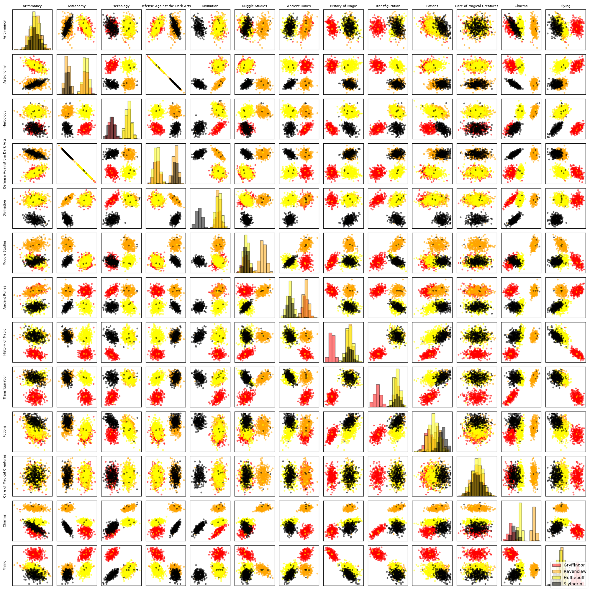

# Model

Contain part 3: Logistic Regression

make pair

Defense against the dark arts and astronomy have the same result.
So we dont need both

the best are Harbology-Astronomy
Herbology-Defense
Ancien Runes Astronomy, ancient runesherbology, ancien rune defense
Charm-Arytmancy
Charm-Astronomy
Charm-Defense
Charm-Divination
(charm-potion)

en fait plus ils ont un indice élévé, mieux c'est....

Logistic regression works almost like the linear regression. Here is a cost (*loss*) function:

$$
J(\theta)
=
-\frac{1}{m}
\sum_{i=1}^{m}
y^i \log\left(h_\theta(x^i)\right)
+
(1-y^i)\log\left(1-h_\theta(x^i)\right)
$$

**cost**

Where $h_\theta(x)$ is defined in the following way:

$$
h_\theta(x)=g(\theta^T x)
$$

**hypothesis**

With:

$$
g(z)=\frac{1}{1+e^{-z}}
$$

**sigmoid dans programm**

The loss function gives us the following partial derivative:

$$
\frac{\partial}{\partial\theta_j}J(\theta)
=
\frac{1}{m}
\sum_{i=1}^{m}
\left(h_\theta(x^i)-y^i\right)x_j^i
$$

- `* Values[feature] ligne107`
- `p-y ligne 104`
- `intégré dans train dans la loop c...` *(texte coupé dans l’image)*
- `weights[feature] -= STEP * (gradient[feature] / len(batch))`

$$
J(\theta)
=
-\frac{1}{m}
\sum_{i=1}^{m}
y^i \log\left(h_\theta(x^i)\right)
+
(1-y^i)\log\left(1-h_\theta(x^i)\right)
$$

**cost**

Where $h_\theta(x)$ is defined in the following way:

$$
h_\theta(x)=g(\theta^T x)
$$

**hypothesis**
    if max == '-inf' or min == 'inf':
        return 'nan'
With:

$$
g(z)=\frac{1}{1+e^{-z}}
$$

**sigmoid dans programm**

The loss function gives us the following partial derivative:

$$
\frac{\partial}{\partial\theta_j}J(\theta)
=
\frac{1}{m}
\sum_{i=1}^{m}
\left(h_\theta(x^i)-y^i\right)x_j^i
$$

Non. Tu ne choisis pas toi-même les poids finaux de chaque feature. C’est précisément la régression logistique qui les apprend à partir des données.

Tu dois seulement leur donner une valeur de départ, par exemple